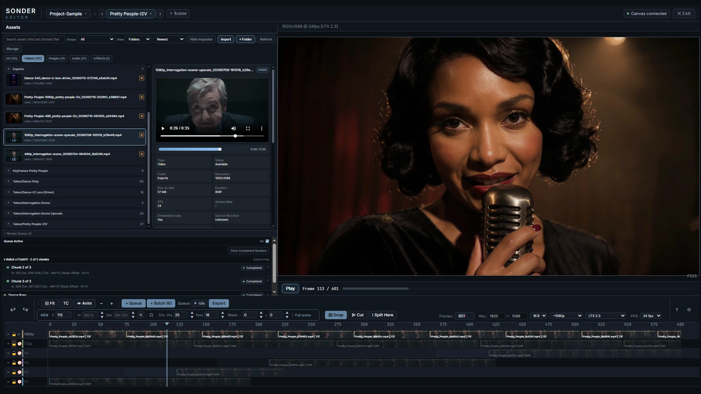
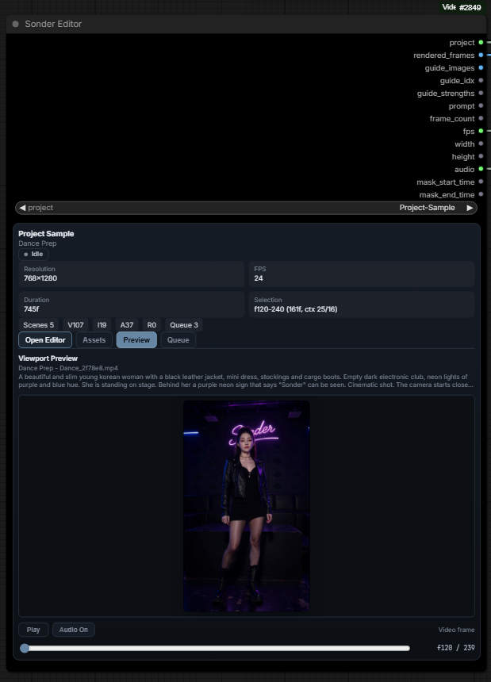

# ComfyUI-Sonder-Editor

Sonder Editor is a timeline-based video editor for ComfyUI, built for iterative
long-form generation. Arrange scenes, clips, audio, guide frames, and prompts;
then select the range you want to process.

Generation stays in ComfyUI; Sonder is where each iteration starts and ends —
send the selection through the connected graph, then review or place the result
back on the timeline. Sonder's generation capabilities and constraints depend
on the diffusion model, nodes, and workflow connected to it.



**[▶ Watch the 90-second overview](https://youtu.be/lixgY2G80xE)**

## What it is

Sonder Editor adds a timeline-based editing surface to ComfyUI without taking
generation out of the node graph. You import media into a project, lay clips,
audio, guides, and prompts onto a multi-lane timeline, select a range (or stage
a batch of render jobs), and hand that off to the generation workflow you've
wired up downstream. Outputs come back as project assets you can review,
compare, and place back on the timeline.

<p align="center">
  
</p>
<p align="center"><em>One native node in your graph — sockets in, sockets out.
The fullscreen editor opens from it, and the dormant node keeps a live
project card and viewport preview.</em></p>

## See it work

Three techniques from the same project, run through the same workflow. Each clip
shows the timeline alongside the result it produced. All three scenes are in the
[sample project](#sample-project) if you want to open them yourself.

### Prompt Relay

Prompt sections are cut along the timeline, each applying to its own range, so a
single clip moves through a whole beat instead of holding one prompt for its
entire length. **Sonder Prompt Relay Bridge** exports the render window's prompt
lanes as ComfyUI-PromptRelay payload strings.

https://github.com/user-attachments/assets/3c1643f7-3944-4949-b7da-a47ad9c5fa5b

### Guides

Guide frames sit on the timeline where you place them — first and last, or any
frame in between — and the model fills what falls between them. Guides have their
own lane and an animatic preview mode; **Sonder Guides Bridge Start / End** wrap
the generation body to inject them per frame.

https://github.com/user-attachments/assets/31e013a7-7e34-4f8d-8dc2-9114fe157165

### IC-LoRA motion transfer

An OpenPose clip on a Driver lane drives the generation frame for frame. **Sonder
Driver Selector** and **Sonder Driver Bridge** resolve and decode that lane for
the render window, so driver and result stay in lockstep on the timeline.

https://github.com/user-attachments/assets/7c8459fb-6d10-4b84-9bc6-a1e98308c3f1

## Highlights

- **Multi-lane timeline** — video/audio lanes with drag, trim, split, snapping,
  lock/hide, lane management, multi-layer compositing, and per-item fit modes.
- **Scenes** — each with its own duration, resolution, and FPS.
- **Prompt sections** — two prompt lanes with Visual/Speech/Sounds channels,
  templates, and history.
- **Guide frames** — per-frame reference images for conditioning, with an
  animatic preview mode. For LTX-style workflows, Settings > Guides exposes a
  project-durable **Guide collision auto-offset** toggle (default on): single-
  image guides are moved to the nearest free temporal coordinate when a Driver
  occupies the same RoPE slot, and the applied move is recorded in generated
  asset metadata. With the toggle off, queueing warns about unresolved
  collisions. The editor CSV outputs and Sonder Guides Bridge are alternative
  injection paths; do not inject the same project guides through both.
- **Selections & context** — saved in/out ranges with pre/post context frames
  and mask offsets for generation overlap.
- **Render queue + batch render** — stage and queue render jobs, including
  contiguous chunked batches.
- **Asset gallery** — project-scoped assets and artifacts, folders, inspector,
  compare mode, trash/restore, favorites, reference-aware deletes, and tracked
  generation metadata.
- **Timeline export** — export video/audio with a streaming CPU compositing path.
- **Color-managed exports** — video presets encode and tag BT.709, and timeline
  decoding honors source color tags, so exports match the browser preview.
- **Playback** — fullscreen/dormant viewport preview with adaptive
  rebuffering.

## Nodes

**Sonder Editor** is the only node you always add — the rest are optional pipeline
adapters, grouped under the `Sonder`, `Sonder/IO`, and `Sonder/Logic` menus in
ComfyUI.

### Editor & generation bridges — `Sonder`

| Node | What it does |
|------|--------------|
| **Sonder Editor** | The main editor and output node: timeline, scenes, gallery, and render queue. |
| **Sonder Guides Bridge Start / End** | Paired loop nodes that wrap a generation body to inject per-frame guide images. |
| **Sonder Driver Selector** | Resolves a selected Driver lane *without* decoding media and exposes a `has_driver` presence flag for lazy routing; pass its reference to the Driver Bridge. |
| **Sonder Driver Bridge** | Decodes the selected Driver lane's frames from a Driver Selector reference, emitting driver images, local start index, and conditioning strength for the render window. |
| **Sonder Masks Bridge** | Exposes the editor's generation-mask window as separate video/audio mask-time pairs, each gated by an Edit/Freeze toggle (a frozen channel emits a zero-width window, so nothing is generated for it). Feed a downstream temporal mask node. |
| **Sonder Prompt Relay Bridge** | Exports the render window's prompt lanes as ComfyUI-PromptRelay payload strings (no model patching). |

### Save & preview — `Sonder/IO`

| Node | What it does |
|------|--------------|
| **Sonder Save Video** | Encodes an IMAGE tensor to a project video asset, optionally muxing audio; previews the first frame. Auto-corrects accumulated VAE color drift against the render's protected context frames (`color_drift_correction`, on by default). |
| **Sonder Save Bridge** | Creates a prompt-isolated output target in the project cache — external save nodes write there, then the bridge registers the results into the Sonder asset system after the prompt settles. |
| **Sonder Preview Video** | Encodes frames to a temporary video for in-UI preview playback. |
| **Sonder Metadata Collector** | Collects explicitly wired upstream widget values into a generated asset's tracked metadata. |

### Routing & logic — `Sonder/Logic`

| Node | What it does |
|------|--------------|
| **Sonder Selector** | Selects one label from a newline-delimited list and outputs its text plus zero-based index. |
| **Sonder Switch** | Routes any one data type across N branches and evaluates only the selected branch (lazy). |
| **Sonder Cluster** | Routes a shared branch selection across multiple lanes, each lane carrying its own type (lazy). |

> **Sonder Switch** and **Sonder Cluster** use ComfyUI's newer (V3) node API and
> load only on recent ComfyUI builds; on older builds they're skipped and the
> rest of the pack is unaffected.

## Requirements

- **ComfyUI** (recent version).
- **Python 3.10+** (matching your ComfyUI environment).
- **ffmpeg** — required for video/audio decode, encode, and export. The
  `imageio-ffmpeg` dependency bundles a usable ffmpeg automatically, but a
  system-wide `ffmpeg` on your `PATH` is recommended for the widest format
  support.
- `torch` is provided by ComfyUI and is **not** installed by this pack (see
  [Troubleshooting](#troubleshooting)).

## Installation

### Option A — ComfyUI-Manager (recommended)

Search for **Sonder Editor** in ComfyUI-Manager and install, then restart
ComfyUI.

> Not yet on the Registry? Use Option B until the first publish lands.

### Option B — Manual (git clone)

```bash
cd ComfyUI/custom_nodes
git clone https://github.com/SonderSaid/ComfyUI-Sonder-Editor.git
cd ComfyUI-Sonder-Editor
pip install -r requirements.txt
```

Then restart ComfyUI. The pack registers its nodes and serves its web UI
automatically.

## Quickstart

1. Add the **Sonder Editor** node to your graph.
2. Open the editor (expand the node card to enter the fullscreen session).
3. **Import media** — drag files or a folder into the asset gallery.
4. **Build a timeline** — drag clips onto lanes; trim/arrange them; add guide
   frames and prompt sections as needed.
5. **Choose what to render** — set an in/out Selection on the timeline, or stage
   jobs in the Render Queue.
6. **Wire the handoff** — connect the editor's output into your generation
   workflow and a downstream **Sonder Save Video** (or **Sonder Preview Video**)
   node.
7. **Run the prompt.** The editor renders the selected window (or queued
   snapshots) into your workflow, and outputs return as project assets.

## Example workflow

Download the **[Sonder LTX 2.3 Playground](example_workflows/sonder_ltx_2_3_playground.json)**
workflow for a ready-wired generation graph covering prompt relay, multi-pass
upscaling, image guides, and driver-controlled generation. It pairs with the
sample project below.

## Documentation

- **[Getting Started](docs/getting-started.md)** — install to first
  generated take, starting with pure text-to-video.
- **[Editor Basics](docs/editor-basics.md)** — layout, timeline, item
  types, gestures, and shortcuts.
- **[Generating](docs/generating.md)** — the generation window, model
  templates, prompts, guides, Drivers, the render queue, and what's frozen
  vs. live in queued jobs.
- **[Assets & Gallery](docs/assets-and-gallery.md)** — asset lifecycle,
  tracked metadata, inspect/compare, and timeline export.

## Sample project

A ready-made showcase project — media, scenes, guides, prompts, generated
takes, and cached thumbnails — is available as a direct download.

1. [Download `Project-Sample.zip`](https://github.com/SonderSaid/ComfyUI-Sonder-Editor/releases/download/project_sample/Project-Sample.zip).
2. Extract it into `ComfyUI/output/sonder-projects/` so the sample sits in
   its own folder there.
3. Open the **Sonder Editor** node and select the project from the project
   selector.

## Security & metadata

- Sonder Editor stores projects as local files under ComfyUI's configured output
  area. Do not expose a ComfyUI instance running this pack to untrusted networks
  unless you have put ComfyUI behind your own authentication and network
  controls.
- Generated files can embed ComfyUI prompt/workflow metadata when **Embed
  Metadata** is enabled on **Sonder Save Video**. Turn that off before sharing
  files if your graph, prompts, paths, model names, or node settings are private.
- Project `media/`, `cache/`, and generated output folders are user data, not
  source distribution files. Do not commit them to a public repository.
- **External Project Links** is off by default. Enabling it in Editor Settings
  makes this ComfyUI installation follow project and media symlinks/junctions
  wherever the editor resolves files. Treat every linked folder as readable by
  anyone who can reach your ComfyUI server.

## Troubleshooting

**`torch` / `torchaudio` got reinstalled and GPU stopped working.**
ComfyUI ships a torch build matched to your GPU/CUDA. This pack intentionally
does **not** list `torch`/`torchaudio` in its requirements so an automatic
`pip install` can't overwrite that build with a mismatched (often CPU-only)
wheel. If audio features need `torchaudio` and it's missing, install the build
that matches your existing torch/CUDA version manually.

**`cv2` import errors after installing another custom node.**
This pack uses `opencv-python-headless` (no GUI dependencies, correct for a
server). Some other custom nodes install the full `opencv-python` package, and
the two conflict — whichever was installed last wins, and the other's `cv2` can
break. If you hit this, pick one variant for your whole environment (headless is
the safe choice for ComfyUI) and reinstall it so it's the only OpenCV present.

**`ffmpeg` not found / export or decode fails.**
Install `ffmpeg` and make sure it's on your `PATH`, then restart ComfyUI. The
bundled `imageio-ffmpeg` binary is used as a fallback, but a system ffmpeg is
more capable across formats.

**I can't link a project on another drive or a UNC share.**
Enable **Allow External Project Links** in Editor Settings first, then use
**Link project folder...** from the project menu and paste the server-visible
path. Local Windows drives use a junction without elevated privileges; UNC
paths need a true symlink, which requires Windows Developer Mode or an elevated
ComfyUI process. Do not toggle the setting while a render or Save Bridge job is
in flight; its finalization safely remains pending until the matching path is
trusted again.

## License

**ComfyUI-Sonder-Editor** — Copyright (C) 2026 SonderSaid

This program is free software: you can redistribute it and/or modify it under
the terms of **version 3 of the GNU General Public License** as published by the
Free Software Foundation.

This program is distributed in the hope that it will be useful, but WITHOUT ANY
WARRANTY; without even the implied warranty of MERCHANTABILITY or FITNESS FOR A
PARTICULAR PURPOSE. See the [GNU General Public License](LICENSE) for details, or
visit <https://www.gnu.org/licenses/>.
