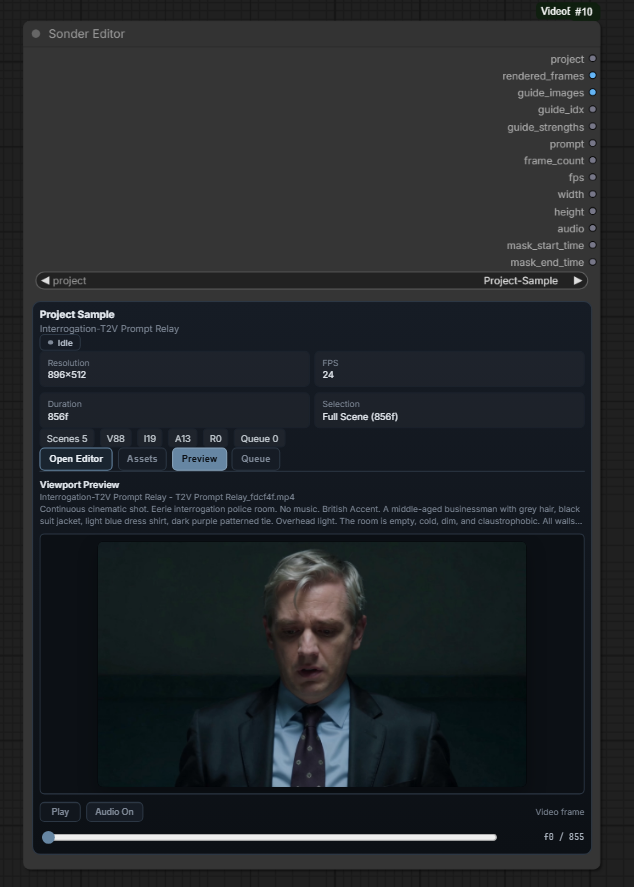
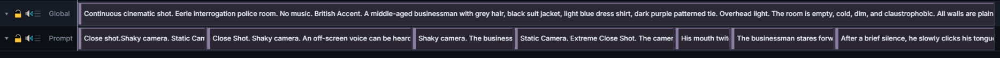
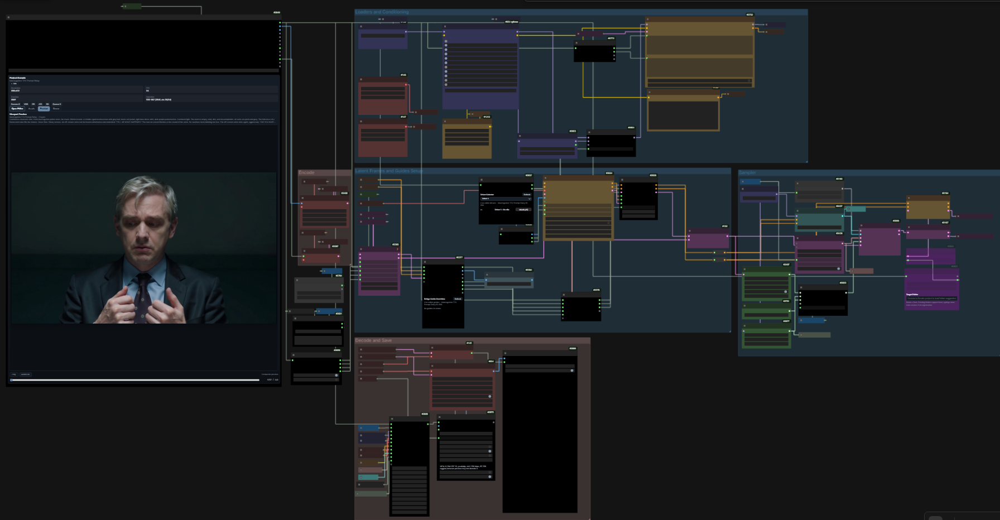
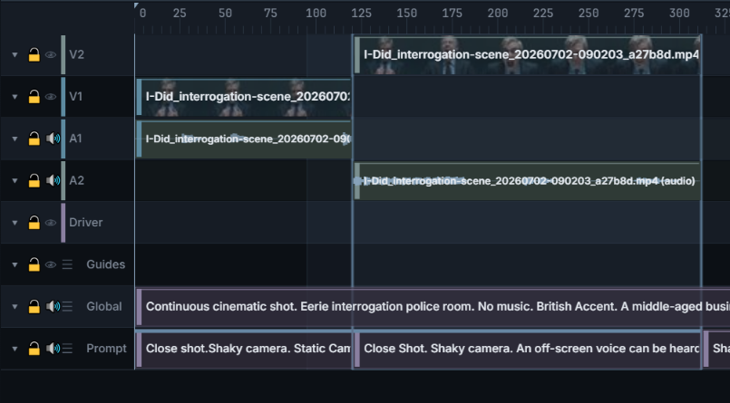
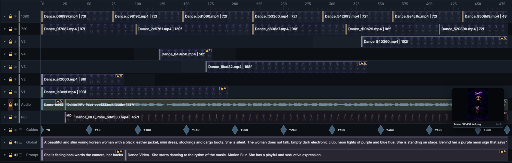

# Getting Started

From a fresh install to your first generated take on the timeline — with
nothing but a prompt. For depth, see [Editor Basics](editor-basics.md),
[Generating](generating.md), and [Assets & Gallery](assets-and-gallery.md).

## 1. Install the pack

Follow the [README installation steps](../README.md#installation)
(ComfyUI-Manager, or git clone + `pip install -r requirements.txt`), then
restart ComfyUI.

## 2. Add the node and create a project

Add the **Sonder Editor** node to your graph (search "Sonder"). The node
shows a compact card with a project selector. Type a name and create your
first project — every project is a self-contained folder (media, scenes,
cache) under ComfyUI's output area, in `sonder-projects/`.

Click **Open Editor** to enter the fullscreen editing surface.

> **Prefer to explore a finished project first?**
> Open [Sonder Editor Projects on Hugging Face](https://huggingface.co/datasets/SonderSaid/Sonder-Editor-Projects)
> and find **Project Sample — LTX 2.3**. Its **Project-Sample** folder includes
> four scenes with media, prompts, guides, and generated takes. The project entry
> includes the matching workflow and opening instructions.

## 3. Pick a model template

In the toolbar, choose the **model template** matching the model your
workflow uses (e.g. **LTX 2.3**) — the editor then snaps frame counts and
dimensions to what that model expects and warns when you exceed its
comfortable ranges. Set the scene's resolution, FPS, and duration in the
same toolbar group. No matching template? Use **No Model Template** and
manage constraints yourself, or create a custom one in Settings.
[Why templates matter →](generating.md#model-templates)

## 4. Write your prompt

For a first text-to-video run, the scene can stay empty — no media needed.

- Double-click the **Global** lane at the bottom of the timeline and write
  the scene-wide text: style, world, characters.
- Double-click the **Prompt** lane below it to create a section and
  describe what happens.

That's a complete T2V setup. Sections hold until the next section starts,
so one section covers the whole scene — add more later to
[direct different moments](prompts.md).

## 5. Choose what to generate

With no selection, the **full scene** renders — fine for a first run. To
render a sub-range instead, press `I` and `O` on the timeline to set the
**In/Out selection**; the GEN block in the toolbar shows the range and its
duration. (The context and mask controls next to it are for
[chaining and inpainting](generating.md#the-generation-window) — ignore
them for now.)

## 6. Wire the handoff

Back on the ComfyUI canvas (Exit fullscreen, or use
[Mount in Tab](editor-basics.md#mount-in-tab) to keep both visible), wire
the Sonder Editor node's outputs into your generation workflow, and end the
chain with a **Sonder Save Video** node so results register back into the
project.

<em>The showcase pipeline — your graph can be as small as
editor → sampler → Sonder Save Video, and grow bridges as you need
them.</em>

Prefer to start from a finished graph? Download the
**[Sonder LTX 2.3 Playground](../example_workflows/sonder_ltx_2_3_playground.json)**
and drop it onto the ComfyUI canvas — it wires prompt relay, multi-pass
upscaling, image guides, and driver-controlled generation already.

## 7. Run it

Queue the ComfyUI prompt as usual. The editor hands your window — geometry,
prompt, and (empty) timeline — to the workflow; when **Sonder Save Video**
finishes, the result comes back as a project asset and, as a **take**,
lands on a fresh lane on your timeline, ready to play in context.

> Your sampler should run a **full denoise (1.0)** for this first pass — an
> empty timeline renders as black frames, and only a full denoise generates
> freely over them
> ([why →](generating.md#empty-timeline-means-black-frames)).

Generate a few takes of the same window, then review them side by side with
[Compare mode](assets-and-gallery.md#compare-mode) and keep the winner.

## 8. Bring in media

Everything past pure T2V starts with assets. Drag video, audio, or image
files (or a whole folder) from your file manager into the **asset gallery**
on the left — originals are copied into the project, so it stays portable.

Drag an asset from the gallery onto the **ruler strip** at the top of the
timeline to give it a new lane (a video with sound creates linked
video + audio lanes). Trim by dragging clip edges, split with razor mode
(`C`). Existing footage, your kept takes, guide images, and Drivers all
combine on the same timeline — that's where the editor starts paying off.

## 9. Where to go next

- **Write in more fields** — the default is one plain prompt box. A
  [Channel Template](prompts.md#channel-templates) splits it into Visual /
  Speech / Sound, or into a model's own fields.
- **Draft a whole scene at once** —
  [Writing mode](prompts.md#the-prompt-management-panel) turns one continuous
  draft into timed sections.
- **Generate longer sequences** — chain windows with context frames, or
  stage many jobs at once with the [render queue](generating.md#the-render-queue).
- **Regenerate part of a clip** —
  [mask a window](generating.md#masking-an-audio-video-latent) so the frames
  around it are kept exactly.
- **Condition harder** — [guide frames](generating.md#guides),
  [Drivers](generating.md#drivers), and time-aligned
  [prompt sections](prompts.md).
- **Reuse characters and places** — build a
  [Reference Library](references.md) and stage its members over a range.
- **Review and finish** — [compare takes](assets-and-gallery.md#compare-mode)
  side by side, then
  [export the timeline](assets-and-gallery.md#export-timeline).
