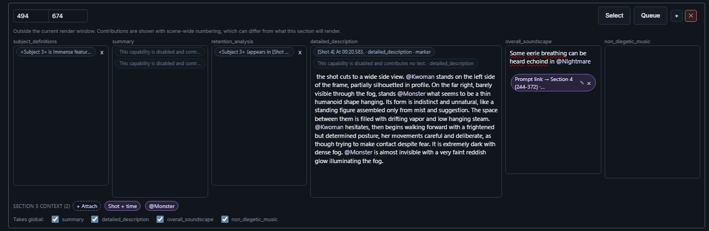
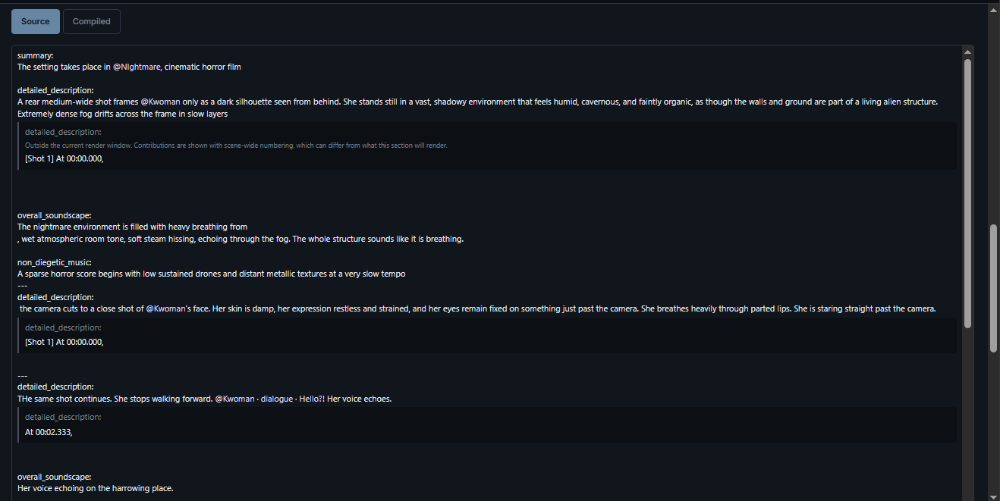
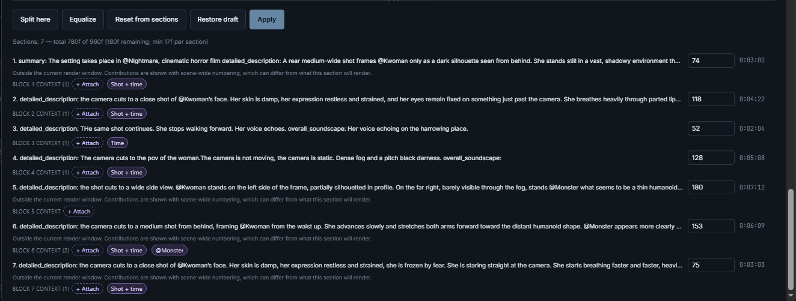

# Prompts

Every render carries one prompt, compiled from what you wrote across the
timeline. Three things decide what that prompt looks like:

| Surface | What it decides |
|---|---|
| **Channel Template** — Settings | Which fields a prompt section has. |
| **Prompt format** — Prompt Management | How those fields are labelled, separated, and validated. |
| **Prompt sections and the Global document** — timeline | What the fields say, and when. |

Timeline gestures for prompt sections are in
[Editor Basics](editor-basics.md#prompt-sections); how a queued job freezes its
prompt is in [Generating](generating.md#whats-frozen-vs-what-stays-live).
References that feed prompts are in [References](references.md).

## How the output prompt is composed

The **Global** document plus every prompt section in the render window compile
into one provider-ready prompt. The project's Channel Template defines the
fields—Standard, Visual/Speech/Sound, MiniMax H3, or a custom set—and its
**prompt format** (technical: Prompt Context Profile) owns labels, separators,
dynamic syntax, writing aids, and validation.

Text stays yours. Dynamic **Context chips** store stable intent and source ids,
then resolve for the selected window: Shot numbering and its optional relative
time, Reference context, Custom text with an optional H3 physical Guide binding,
managed Vocal Events, and links to earlier prompt sections. Fixed syntax such as
dialogue wrappers and camera phrases is inserted as a profile-provided **Writing
aid**. Hover previews use the latest live
compiler result; blocking diagnostics must be repaired before queueing.

Timeline prompt bars show **All channels** by default. You can focus one channel,
and that presentation choice is remembered per Channel Template. Hidden
channels stay mounted with their caret/undo state and show non-empty counts
beside the Channel selector. Switching is presentation only; it never moves or
flattens authored text or chips.

- **Boundary Prompt Threshold** (project-wide) drops a section from a window
  when the selection clips only a tiny edge sliver of it — so frame snapping
  can't bleed a neighbor's text into your generation. The timeline shows
  affected slivers with a dim "Ignored" hatch, and sections that *will*
  compose get a strong accent.
- Lane hiding is part of composition: Prompt lane hidden → global-only
  output; Global hidden → sections only; both hidden → empty prompt.
- **Takes global** on a section decides, per channel, whether that field picks
  up the scene's Global text. Only channels whose Global actually carries text
  are offered. Untick one and the global text is dropped from any render that
  covers only sections which opted out.

## Channel Templates

A Channel Template decides which fields a prompt section has. It is
**project-wide**: every section in the project authors the same set.

Set it in **Settings ▸ Prompts ▸ Channel Template**. A new project starts on
**Standard** — one plain field, no field names — unless you change the default
under **Settings ▸ Channel Templates**.

Built-ins cover the common cases: one plain field, the editor's Visual / Speech
/ Sound split, and MiniMax H3's own field sets. You can also create your own.

A custom template declares:

- **Channels** — each with a key, the header written into output, and the
  authoring guidance shown while writing that field.
- **Field names** — always written, or never. A template that writes them needs
  a header on every channel.
- **Separators** — between fields (space, newline, blank line), and between a
  header and its text (space, colon, colon + newline).
- **Shot marker channel** — which field carries shot markers.
- **Default draft channel** — where unheadered Writing-mode prose lands.
- **Global merge** — whether the scene-global prompt leads the whole prompt, or
  is authored per channel.

**Where each half lives matters.** Your custom definitions are **browser-local**
— they belong to the editor, not the project. The *active choice* is saved into
the project, which keeps its own copy of the definition. So a project opened on
another machine still has its fields, but the definition won't be in the catalog
there, and editing a catalog template never reaches a project that is closed.
When a project holds an older copy of a template you have since edited, its
settings card says so, and **Use** replaces it.

## Prompt formats

Where a Channel Template says what the fields *are*, a **prompt format** says
how they are written: labels, separators, dynamic syntax, writing aids, and what
counts as valid. Diagnostics and the code call it a Prompt Context Profile.

A format is chosen **per scene**, in the Prompt Management panel's
**Prompt Context** section — though you rarely have to. Each Channel Template names the format it
expects, and a scene follows that automatically; picking one explicitly is what
unpegs it, and from then on that scene keeps your choice.

Formats target a particular template, so one built for a different template
appears **disabled rather than hidden**, and an existing mismatched pairing
stays visible instead of vanishing.

Built-in formats are immutable. **Save as custom…** creates your own from one,
and editing a custom format creates a **new version** rather than changing the
one your scenes already point at.

A custom format is purely declarative: routing and placement, the vocabularies
its controls offer, label templates, descriptions, examples and help, identity
kinds, reference populations, and speaker policy.

## Context chips

A chip stores *intent* rather than words — which Reference, which shot, which
earlier section — and resolves to the right wording when the prompt compiles for
the selected window. That is what lets a prompt survive restaging and
renumbering without being rewritten.

It also means you can name the same thing wherever it belongs without repeating
it in the output. Chips resolving to equivalent text in one channel emit
**once**; the rest report *deduplicated* instead of writing the line again. When
the same text would be emitted for a *different* subject or slot, that is
flagged rather than silently merged — the fix there is to blank one chip's
field, not to drop a line. Splitting a section keeps this intact: the halves
carry separate chips that still deduplicate against each other in a combined
render.

**+ Attach** adds one, and the same dialog configures it before it exists rather
than sending you hunting for it afterwards. A chip carries a small `✎` because
it is an editor, not a static token. Chips sit either inline in a field or in the
section's own context row, depending on where the format places them.

A chip can also be switched off for a single field without being removed. That
field then says the capability is disabled and contributes no text, so a chip
you have silenced stays visible rather than vanishing from the section.

Because a chip resolves against a window, editing a section that falls **outside
the current render window** shows scene-wide numbering instead — the panel says
so, and warns that those numbers can differ from what the section will render.

| Chip | What it contributes |
|---|---|
| **Shot** | Shot numbering, with an optional relative time. |
| **Time** | A timestamp on its own. |
| **Reference** | Context for a staged Reference or a prompt identity. |
| **Vocal Event** | A managed piece of speech or song. |
| **Prompt Link** | A link to an earlier prompt section. |
| **Custom** | Your own text, optionally bound to an H3 physical Guide. |

Overrides on a chip disclose by **state, not category**: fields still following
their source collapse into one line naming the most specific source in play,
while an actual override always stays visible.

## Writing aids

Some provider syntax is fixed — a dialogue wrapper, a scene-transition marker, a
camera phrase from a set vocabulary.

A **Writing aid** inserts that syntax for you. Which aids exist, and which
channels offer them, is declared by your **prompt format**, so you are shown
only the ones valid where you are writing — and the same aid can insert
different text under a different format. MiniMax H3, for example, carries the
generic set bound to its description channel but writes voiceover its own way.

Generic formats offer dialogue, voiceover, group speech, singing, scene
transition, cutoff, visible text, camera motion and framing. Some take fields —
dialogue asks for a language, camera motion offers a list of moves — and what
they insert is ordinary text you can edit afterwards.

## Prompt identities

An **identity** is a provider-neutral record of who or what a prompt is talking
about. You create one explicitly in Prompt Management; the Reference Library never
mints one for you.

An identity may combine several Library members, each with its own contribution,
or exist from a description alone with no media at all. When an audio member is
attributed to one, it declares that identity's voice: that member's prose feeds
the audio definition rather than the appearance.

Identities and Reference members share one set of handles, so `@Anna` reaches
whichever you named. Deleting a Reference or member removes the source
relationship but leaves the identity visible for repair.

Identities live under **Identity Prompting**, beside **Reference Prompting** in
Prompt Management. Which identity kinds exist is declared by your prompt format.

**Reference Prompting** shows the physical media your prompt format asks for —
editable handles and per-member defaults — and, below that, the prompt text each
staged Reference derives from its lane recipe, read-only, with whether it falls
in the current render window and which parts the recipe added. The derived list
does not depend on the format declaring anything, so it is there on the default
Generic format too. Edit that text in Reference Lane Setup; this screen reports
it.

## The Prompt Management panel

Open it with **☰** on the Prompt or Global header. Two modes, and the difference
that matters most is whether they write to your prompts as you type.

### Structured mode — live

Global and per-section document editors, carrying the same inline and scope
Context chips as the timeline bars, plus range and channel controls, per-row
**Select** and **Queue**, reusable prompt **templates**, and an enqueue-captured
**history** you can re-apply in one click.

Edits here are edits to the prompts themselves. There is nothing to commit.

### Writing mode — a draft

One continuous chip-aware draft of the whole lane. A line containing only `---`
splits sections, a line like `visual:` starts that channel, and unlabelled text
goes to the template's default draft channel. An allocation strip distributes
frames per block.

Two views share one draft. **Source** is where you write — channel headings,
break lines and chip contributions all editable, with each chip's contribution
shown as prose beneath the text it attaches to. **Compiled** is read-only output
from the same compiler the render uses, for checking what the draft becomes.

**Nothing here reaches your prompts until you Apply** — and nothing your prompts
do reaches the draft on its own either. Traffic moves only when you ask, in
whichever direction you ask for:

- **Apply** replaces the lane's sections with the draft blocks, in one undoable
  step. It means *make the lane match this draft*, so it also replaces any
  section edits made elsewhere since you started writing. It can extend the
  scene if the draft runs past the end, and is refused only by a locked Prompt
  or Global lane, or an empty draft.
- **Reset from sections** pulls the other way, rebuilding the draft and its
  lengths from the lane's current sections. The draft you had is kept, and
  **Restore draft** brings it back.

Alongside those, **Split here** breaks the draft at the caret and **Equalize**
resets every block to an equal share of the scene.

<em><strong>Restore draft</strong> appears only while a draft is stashed, which is what makes <strong>Reset from sections</strong> safe to press.</em>

Applying an unchanged draft is safe: muted state, per-channel global opt-outs,
stable empty sections, and internal Prompt Link identities all survive it, as
does a deliberate split or merge.

Drafts are saved in your browser, per project and scene — not in the project.
They don't travel to another machine, and clearing site data loses them.
