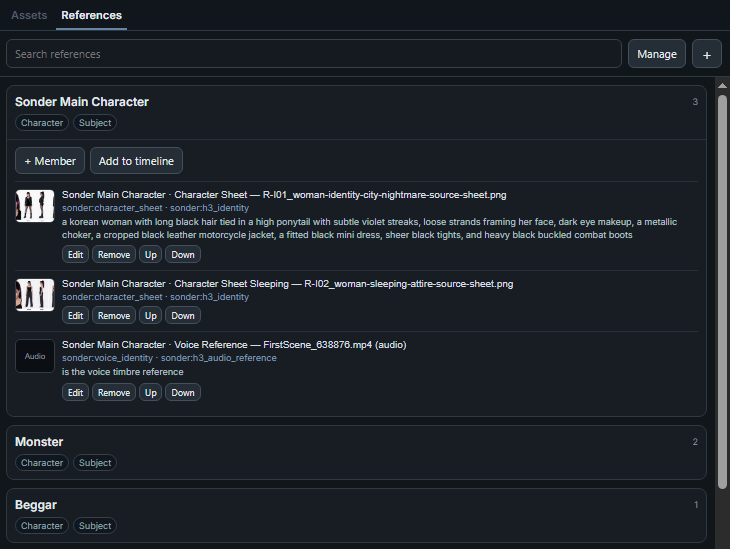
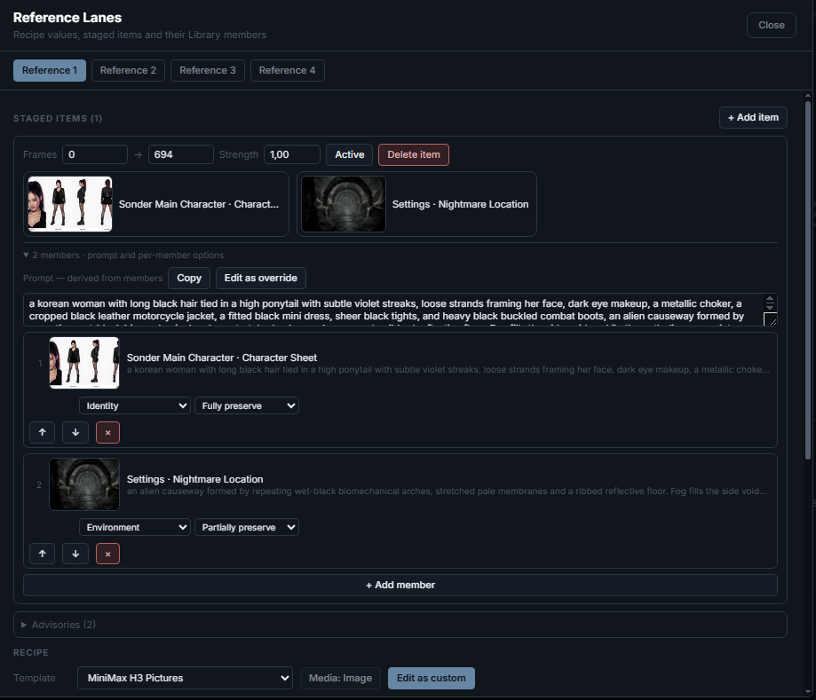
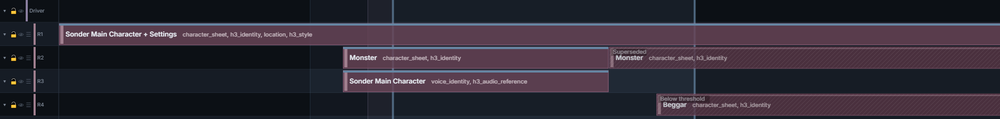

# References

A **Reference** is a reusable piece of a project — a character, a location, a
prop, an outfit — kept in one place and used wherever it applies.

Three surfaces divide the work:

| Surface | What it is for |
|---|---|
| **Reference Library** — sidebar | Registering and managing References and their media. |
| **Reference lanes and recipes** — timeline | When a Reference applies, and how it is served to your graph. |
| **Reference Prompting** — Prompt Management | Naming References in prompts, and deriving text from them dynamically. |

In practice you meet them in that order — who or what it is, when and how it
applies, then what the prompt says about it:

```
1 ── WHO / WHAT ───────────────── Reference Library, sidebar ──

    Anna ─┬─ closeup   image   "a woman in a red coat"
          ├─ sheet     image   "full turnaround, neutral light"
          └─ voice     audio   "low, unhurried"

    One Reference, several members. Each member owns its media,
    its @handle, and its own prompt text.

                 │  drag a member onto a Reference lane
                 ▼

2 ── WHEN & HOW ─────────────────── Reference lane, timeline ──

    the staged item   frame range · strength · Active
    the lane recipe   how the members are assembled, and which
                      Bridge outputs go live

    For a generation window every staged item gets a verdict:
    In window / Superseded / Below threshold / Outside / Excluded

                 │  the winner now serves the graph twice
                 ▼

3 ── WHAT IT SAYS ABOUT IT ───────────────── the prompt text ──

    The recipe composes one string from the members you staged:

        prefix  ·  one expansion per member  ·  suffix

    Attach it as a Context chip, or wire the Prompt Bridge. That
    choice decides which socket below carries it.


── the two servings, converging on your graph ─────────────────

  Sonder Editor ─┬─ project ──> Reference Selector
                 │                      │  one reference_set
                 │          ┌───────────┼───────────┐
                 │          ▼           ▼           ▼
                 │       Image       Audio       Prompt
                 │       Bridge      Bridge      Bridge
                 │       r01..r16    a01..a16    reference_prompt
                 │       └─── the media ───┘     └─ the text ─┘
                 │
                 └─ prompt ───────────────────> the text again, if
                                                you attached a chip
                                                instead — already
                                                compiled in
```

Assets themselves are covered in [Assets & Gallery](assets-and-gallery.md),
timeline gestures in [Editor Basics](editor-basics.md), and generation in
[Generating](generating.md).

## Reference Library

Switch the fullscreen or mounted left sidebar from **Assets** to
**References**.


<!-- The tag picker in this image predates the verified family-grouped UI and remains flagged for later regeneration. -->

- Create a named **character**, **location**, **prop**, or **outfit**, choose
  whether it is a **subject** or **context**, and give it a one-line
  description. Locations begin as context; the other kinds begin as subjects,
  and either can be changed.
- Cards show their kind, class, description, member count, and unresolved
  state. **Manage** reveals entity Edit and Delete.
- Add one image, audio, or video asset at a time. The picker can **Inspect** a
  source without selecting it. After selection, only compatible built-in tags
  are offered; custom tags remain unrestricted.
- Members can carry tags, prompt text, an image/video crop, and an
  audio/video start/end trim. A blank end uses the rest of the source.
- **Crop & Preview**, **Trim & Preview**, or **Crop, Trim & Preview** opens the
  focused visual editor. **Full Source** shows editable crop/trim geometry;
  **Applied Result** shows only the cropped or trimmed result. Audio edits its
  trim on the waveform and seeks on a separate bar; video uses the same
  transport, with a waveform when it has audio.
- Drag a crop's interior to move it, its edges or corners to resize. Choose the
  same ratio presets used by the timeline, **Free**, or **Custom** with a
  width/height ratio such as `3 × 10`. Trim handles resize the interval;
  dragging its middle moves it without changing its duration.
- **Space** plays or pauses the active view, and focused crop and trim controls
  take Arrow-key nudges — the full list is in the editor's **?** shortcut
  atlas. **Apply to Draft** returns your edit to the member; nothing reaches
  the project until you Save.
- **Edit**, **Remove**, and **Up/Down** act on individual members, with explicit
  Save and Cancel. Swapping a member's source asset happens inside its editor.
- Search matches reference names, kinds, descriptions, current asset names, and
  both the stored id and displayed label of member tags. Missing, Trashed, and
  unresolved members stay visible.

## Tags

Tags are how a member says what it *is* — a face close-up, a turnaround, a
voice. They do two jobs.

**They make the Library readable.** A wall of near-identical thumbnails is hard
to scan; tags give each member a label you can search on, alongside names,
kinds, and descriptions.

**They let a recipe ask for what it needs.** Each recipe carries the tags it
works best with, and a lane whose staged members don't include one raises a
suggestion to stage it. LTX Best Face ID asks for a face close-up; MiniMax H3
Pictures asks for identity, environment, style, motion, storyboard, or
composition-anchor inputs. These are suggestions, not requirements — nothing
is blocked, and the only hard limit is the recipe's member cap.

A tag describing content is universal. A tag naming a provider input slot
carries its family: for example **Motion Reference** is universal, while
**MiniMax H3 · Motion** names an H3 slot. The picker groups those families, and
the Library, timeline, lane setup, live graph Selector, advisories, and asset
usage rows all resolve them from the same declared label. Compact canvas labels
use the same data in a shorter form, such as **H3·Motion**. A running frozen
Selector deliberately keeps its frozen raw ids instead of relabelling them from
live metadata. Custom and unknown tags also keep their authored text.

Built-in tags are media-aware, so once you pick an asset only the tags that fit
it are offered: Voice Identity takes standalone audio, and video only when the
clip has embedded audio. Custom tags are free text and carry no media rules.

Tags never reach the model on their own. They describe a member and guide
staging; what the model receives is its media and its prompt text.

## Reference lanes

A Reference lane holds **Reference items** — ranges saying which Library
members apply over which frames, say this character's face plus this outfit
from frame 0 to 120.

The item points at the Library rather than holding a copy of anything. Edit a
member there and every item using it follows; move or trim an item and you
change *when* those references apply, never the media itself. An item always
carries at least one member, and a blank end runs to scene end.

Each lane holds one media kind, so items can't move between an image lane and
an audio lane. Items on a lane can't overlap. Each item can be muted and
carries its own conditioning strength. The lane header carries the lane name,
with the recipe name beside it when the header is wide enough; item bars show
their member names, then the same tags in compact form.

Create items by dragging from the **References** sidebar onto the timeline, or
with **Add to timeline** on an expanded Library card; the rules are in
[Editor Basics › Reference items](editor-basics.md#reference-items).

A Reference lane header's **☰** (also on its right-click menu) opens the lane
Setup overlay — staged members, their order, and the recipe that decides how
they're assembled for the model.

## Recipes and lane setup

A lane's **recipe** decides how its staged members become model input. Open it
from the lane header's **☰**.

Every recipe starts with an **Assembly**, the choice that shapes everything else:

| Assembly | What the model receives |
|---|---|
| **Batch** | Each member stays a separate image, stacked into one batch — a set of identities. |
| **Sheet** | Members are composited into one image, a panel grid or a vertical strip, for models that read a single reference image. |
| **Temporal** | Members are laid out along time, each holding a contiguous run of frames. |
| **Slots** | Each member goes out on its own numbered socket (`r01`, `r02`, …) for models that take separately wired inputs. |
| **Audio** | The member is trimmed audio rather than an image; only the audio outputs carry anything. |

Recipes that ship built in:

| Recipe | Media | Assembly | Members |
|---|---|---|---|
| LTX Multiple Subject Reference | image | temporal | 5 |
| LTX IC-LoRA Ingredients | image | sheet | 16 |
| LTX Best Face ID | image | sheet | 4 |
| LTX ID-LoRA Voice Identity | audio | audio | 16 |
| Wan VACE Reference Sheet | image | sheet | 16 |
| Wan Phantom Identities | image | batch | 4 |
| Wan SCAIL Identities | image | batch | 6 |
| Wan Bernini-R References | image | slots | 8 |
| MiniMax H3 Pictures | image | slots | 9 |
| MiniMax H3 Videos (IMAGE sequences) | image | slots | 3 |
| MiniMax H3 Standalone Audio | audio | audio | 3 |

Selecting a built-in recipe materializes its current values onto the lane; an
existing lane does not generally live-follow later catalog corrections.
**Edit as custom** forks those values into a project recipe you can change. To
return to the current built-in, pick it again from the lane's template dropdown.
That re-materializes the built-in and discards the fork's edits.

Several model contracts need one extra setup detail outside the recipe:

- **LTX Best Face ID** uses a canonical lone-reference frame of `460×406`
  (`1.133:1`). A portrait face crop is therefore pillarboxed to roughly 59–66%
  frame fill unless the Library member's crop box matches that aspect.
- **LTX IC-LoRA Ingredients** needs both `Reference sheet: [...]` and
  `Generated video: [...]`. The recipe supplies both labels — `Reference
  sheet:` as its prefix and `Generated video:` as its suffix — so the derived
  prompt arrives already closed. What is still yours is the generated-video
  description that follows the label, written on the prompt track.
- **MiniMax H3 Pictures** assumes the consuming node's `ref_image_size` is
  `max`. The node defaults to `match`, which rescales to the generation's pixel
  area and discards the recipe's 2048-short-edge preparation. The recipe mirrors
  the node's nearest-`/32` image rounding; set the node to `max` when using it.

The **Reference Lanes** overlay opens on the lane's staged items: each item's
frame range, strength and Active state, its members as `Reference · Member`
thumbnails, and its advisory count. Tabs along the top switch between Reference
lanes without closing it.

Expanding an item reaches its derived prompt and its per-member controls, where
each member carries a **role** and a **preservation** choice drawn from the
recipe's own catalogs. The recipe itself sits below, showing only the fields
your Assembly actually uses.



Some values are **pegged** rather than typed — the frame grid and snap multiple
follow the scene's model template, a sheet's loop length follows the render
window. A pegged value names the source it follows, and falls back to its
authored number when that source is unset.

Grid sheets choose the column count that gives their actual members the most
fitted image area. Four square members form a `2×2`; four portrait members form
the accepted `4×1` layout rather than reserving empty cells.

## What a generation window resolves to

Staging an item doesn't guarantee the model sees it. For the current generation
window every staged item gets a verdict, shown on the timeline and in the lane
panel alike:

| Verdict | Meaning |
|---|---|
| **In window** | Most-specific-wins resolved this item; it's the one the model receives. |
| **Superseded** | Another item on this lane covers this window more tightly, so that one is sent instead. |
| **Below threshold** | The overlap is below the threshold relative to the shorter item/window span, so this item is not sent. |
| **Outside window** | The item doesn't overlap the window. |
| **Excluded** | Muted, or on a hidden lane, so it never participates. |


<p align="center"><em>Only the solid bars reach the model. <strong>Superseded</strong> lost to an item covering the window more tightly; <strong>Below threshold</strong> was dropped because its overlap is too small relative to the shorter item/window span.</em></p>

**Reference Threshold %** (Settings, project-wide) measures overlap divided by
the shorter of the item span and render-window span. An item containing the
window, or fully inside it, scores 100% and stays even at threshold 100.
Crossing an edge reduces coverage smoothly; a short neighbor mostly inside a
long window can still stay. Unlike prompts, filtering can leave a lane with
*nothing*. Lower the threshold or extend the staged range into the window.
Surviving items still compete by overlap divided by their own span; winner
scoring is unchanged.

With no selection nothing is marked, since the marks answer "what will this
render use".

Queueing a **batch** predicts all of this per chunk before anything runs, and
says whether a lane drops because of the threshold or because that chunk falls
outside the staged range. A lane that resolves in no chunk always warns.

## Prompts from References

References reach a prompt two ways, and they suit different jobs.

### The lane's derived prompt

A staged item carries prompt text as well as media, assembled from the members
themselves so it tracks what you stage.

The lane panel shows it in one of two states. **Prompt — derived from members**
is read-only, built from each member's own text through the recipe's pattern,
and follows every staging change. **Copy** takes the text; **Edit as override**
hands you the same text as an editable draft. Once overridden the header reads
**Prompt — overridden**, the derived version stays visible beside it, and
**Clear** goes back to following the members.

Three recipe fields shape the derived text:

- **Prompt prefix** — static text placed once at the front, not repeated per
  member.
- **Per-member token** — a pattern expanded once per staged member.
  Use `{n}` for numbering from 1, `{index}` from 0, and `{prompt}` for the
  member's prompt text. `{name}` supplies its prompt-safe `Entity_Member`
  label; `{entity_name}` and `{member_name}` supply the parts separately.

  For example, `Reference {n}: {prompt}` produces
  `Reference 1: a woman in a red coat`. If the pattern contains none of the
  text or name placeholders, the member's text is appended after it. Leave
  the field empty to use the member's text, falling back to its name.

  `{n}` and `{index}` describe positions within the recipe output, not MiniMax
  H3 ordinals. H3 Subject/Picture numbering comes from the recipe's **Model
  input** — Pictures, Videos or Standalone Audio, which the built-in H3 recipes
  already set. Lane order then numbers those slots across lanes, and **Move
  Lane Up** / **Move Lane Down** in the lane header menu renumbers them. A
  Reference Context chip reads the ordinals from the compiled setup, so you
  never count them by hand.
- **Prompt suffix** — static text placed once after the whole thing, for a
  format whose reference block is closed by a second label. LTX IC-LoRA
  Ingredients uses it for `Generated video:`, which leads the prompt you write
  next.

Each per-member expansion also goes out on its own numbered Prompt Bridge
output, so a graph can wire one member's text separately from the aggregate.
The prefix and suffix are not repeated there — they open and close the whole
block, not each member.

The derived text has two exits and neither is automatic: wire the Prompt
Bridge's `reference_prompt` output in the graph, or attach the staged item as a
Reference Context chip. The lane panel says which of the two are available and
whether a chip is attached.

Prompt Management's **Reference Prompting** section lists the same text for
every staged Reference, read-only, with whether it falls in the current render
window and which parts the recipe added. It is the one place to read what all
your staged References contribute without opening each lane.

### Attaching a Context chip

A fixed pattern only goes so far. When the wording depends on which References
actually win the window, or the provider expects numbered labels you would
otherwise count by hand, **attach a Context chip to the prompt field** instead.
**+ Attach** picks the target Reference or identity and configures its
overrides in the same dialog; the chip then resolves against the selected
generation window when the prompt compiles.

This is how **MiniMax H3 (full reference)** prompts are built. That format
declares subject, picture, video, and audio populations, and the chips take
their ordinals from the compiled setup rather than from anything you number
yourself.

**Reference Prompting** in Prompt Management is where this is authored. It shows
the physical media resolved from the active setup and window, and is where you
give each member the handle and prompt text its chips will use. Staging stays
in Reference lanes — Reference Prompting never moves anything on the timeline.

Beside it, **Identity Prompting** authors semantic prompt identities —
provider-neutral records that may combine several Library members or exist from
a description alone. An identity is not a Reference, and the Library never
creates one for you; see [Prompts](prompts.md).

### When the Reference isn't in the window

A chip can name a Reference that doesn't win the current window — its lane is
muted or hidden, its item is superseded, below threshold, or simply outside.
The render still goes ahead, and the chip raises an advisory instead of
blocking the job.

That is what makes a deliberate reference-free pass possible: for a final
low-denoise upscale you mute the Reference lane so nothing influences detail,
and every chip bound to that lane follows the mute. The node path reads the
same fact the same way — a muted lane yields `has_reference = 0`, so the gate
skips the Bridges.

A **deleted** source is a different matter and does block. That is broken
authoring rather than a fact about this window.

What becomes of the chip's own authored text is a policy you choose:

| Policy | What reaches the prompt |
|---|---|
| **Drop** (default) | Nothing. The chip's text stays out of the prompt. |
| **Keep** | The authored text, with no Reference conditioning the render. |

Set it project-wide in **Settings ▸ Prompts ▸ Out-of-window Reference text**.
Any single chip may disagree: its configure dialog carries an **Out-of-window
text** row offering *Project default*, *Drop* and *Keep*, and a chip that
overrides the project shows a small `KEEP` or `DROP` badge. The override is
local to that chip **including linked copies**, so splitting a section leaves
the two halves free to differ.

Keep preserves what *you* wrote, not what the compiler would have claimed for
you. A derived appearance clause such as `(appears in [Shot 3])` follows the
conditioning rather than the prose, so it is not added for a chip that isn't
conditioning the window under either policy.

Advisories aggregate per lane and cause, so muting a lane on a dense timeline
reads as one advisory naming every affected chip. When text is kept a second
advisory says so. Either way every affected chip is still marked individually in the
Prompt panel.

### Mentions

Reference members and prompt identities share one set of **handles**. Typing
`@Anna` in any prompt field compiles to whatever label your prompt format uses,
and the editor marks it so you can see it is live.

Mentions are ordinary text, which is what lets them survive copy, cut, and
paste. Prose can name a handle that doesn't exist yet and wire itself up when
you create it. An `@` that isn't one of your handles — an email address
included — is left exactly as you wrote it.

Reference **Context chips**, which carry the same intent without typing
provider ordinals by hand, are covered in
[Prompts](prompts.md#how-the-output-prompt-is-composed).

## Wiring the nodes

Four nodes carry References into a graph: the **Selector** resolves lanes
without decoding anything, and the three **Bridges** decode what it resolved.

```
Sonder Editor ──project──> Reference Selector ──reference_set──> Image Bridge
                                    │                            Audio Bridge
                                    └── has_reference ── gate ──> Prompt Bridge
```

Prefer to start from a finished graph? The
**[Sonder MiniMax H3 References](../example_workflows/sonder_minimax_h3_references.json)**
example workflow has all four wired against MiniMax H3, alongside first- and
last-frame guides and latent noise masks.

**Sonder Reference Selector** takes the editor's `project` output, and its own
panel is where you choose **one or more Reference lanes** to send on. `+` lists
the lanes available, each chosen lane becomes a removable row, and several
lanes combine into one ordered set. A lane that no longer exists is skipped
rather than quietly substituting another.

It emits:

- `reference_set` — fan out to whichever Bridges you need.
- `has_reference` — `0` when no selected lane has an item effective for this
  window, `1` when any does. Gate the branch holding the Bridges on this so it
  genuinely does not execute.
- `reference_strength` — the authored strength of the first effective lane in
  lane order, or `0.0`.

Co-selected lanes must agree. A candidate whose media kind, materialized
recipe, or effective prompt override differs from the lanes already selected is
listed but disabled, with the reason shown; a blank or detached recipe can only
be selected alone.

Each Bridge exposes 16 numbered outputs:

| Bridge | Outputs |
|---|---|
| **Image** | `r01`–`r16` |
| **Audio** | `a01`–`a16` |
| **Prompt** | `reference_prompt`, `reference_names`, then `p01`–`p16` |

Slot order follows staged member order, and lanes concatenate in lane-index
order. Non-slot assemblies emit one payload per lane; slot recipes emit one
member per output.

**Slots never move.** A selected lane reserves its widest staged member count
whether or not it is currently effective, so an inactive earlier lane leaves
its outputs reading `(unused)` rather than shifting later lanes down — a
socket's position is what ComfyUI type-checks against.

The Image and Audio Bridges take an **`unused_slots`** choice for outputs the
recipe does not drive:

- **`placeholder`** (default) — a black scene-size image, or a one-second
  silent stereo track. A consumer whose input is *required* needs this.
- **`nothing`** — no value at all, which a consumer with an *optional* input
  skips entirely. Use it when a placeholder would be read as real content.

A dead slot wired to a proven-required input reads `(unused · required input)`,
so the mismatch shows on the canvas.

To wire a full block up front: stage members to the recipe's cap, wire every
output you want, then remove the surplus. The connected slots stay visible, so
the links hold.
